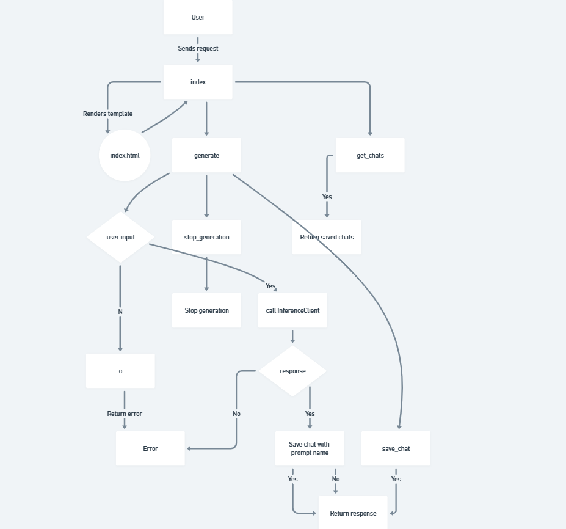
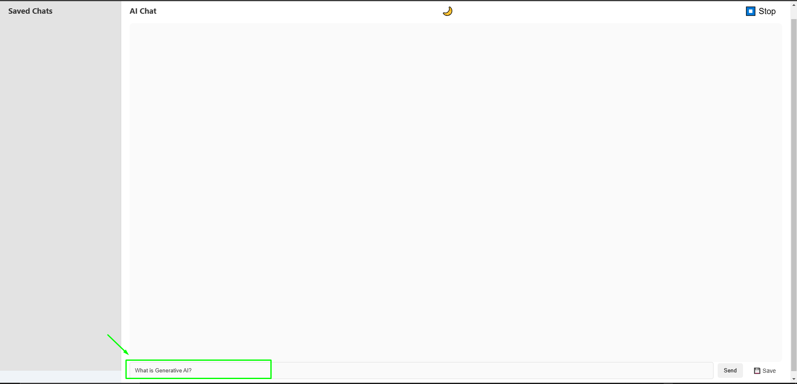
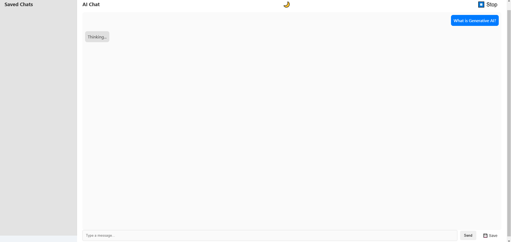
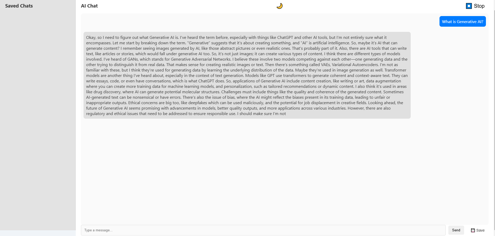
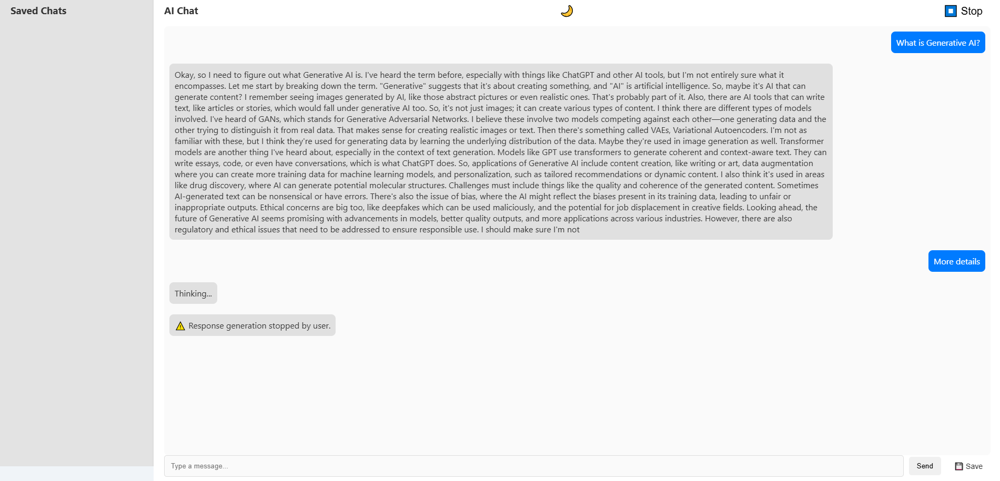
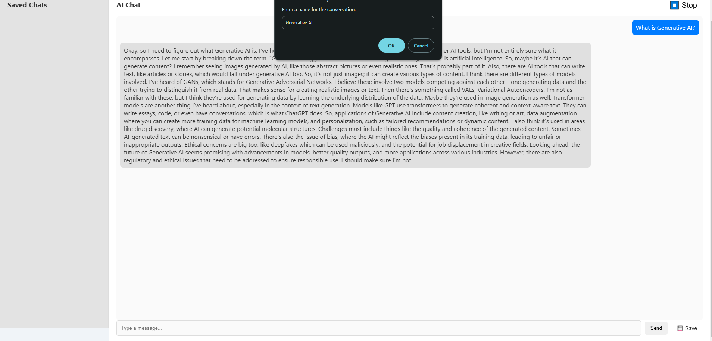
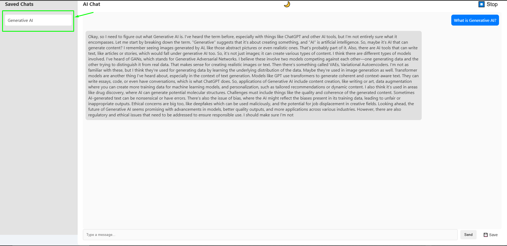
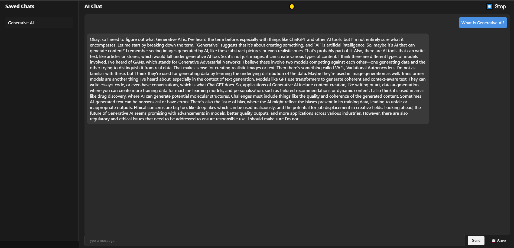

## AI Chat Web App

### Overview

This project is an AI-powered chat application where users can enter a prompt and receive a response generated by an AI model. The application allows users to stop response generation, save conversations, and manage previous chats.

### Features

- ✅ **Accepts user input as a prompt**
- ✅ **Generates AI-powered responses**
- ✅ **Stop button to halt response generation**
- ✅ **Save button to store conversations**
- ✅ **View and manage previous conversations**


### Architecture Diagram

A simple representation of the application's flow:

```
User Input → API Request → AI Model → Response Generation → Display to User
```
- 

### How It Works

1. **User Input**
   - The user enters a prompt and submits it.
   - 

2. **AI Processing**
   - The system processes the input via an AI API and generates a response.
   - 

3. **Response Display**
   - The generated text is displayed to the user.
   - 

4. **Stop Button**
   - Users can halt response generation mid-way.
   - 

5. **Save Button**
   - Users can save the conversation for later review.
   - 
   - 
6. **Dark Theme**
   - 

### Personal Notes

This project demonstrates the interaction between users and an AI model in a simple yet effective way. The inclusion of a stop button improves user control, and the save feature adds practical usability. Future improvements could include enhancing UI/UX, adding multi-turn conversation history, and implementing different AI model choices.

--- 

